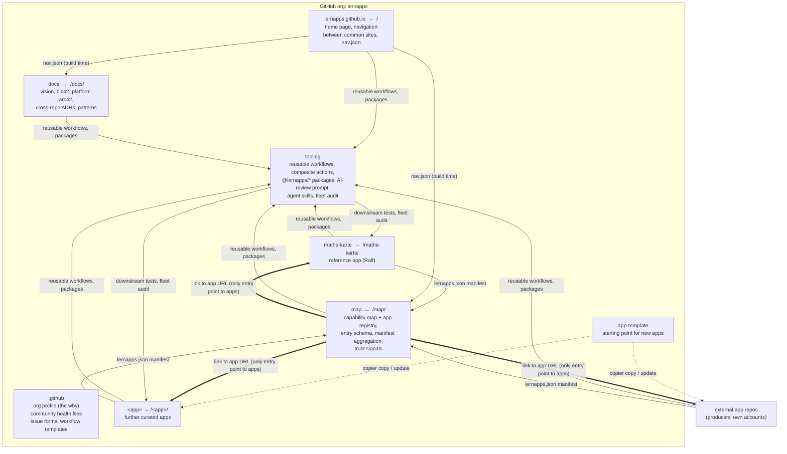

# lernapps.net – Target structure of the GitHub organisation

Status: **Agreed in principle** by the org owners Oliver and Ralf; open points are `decision` issues · Date: 2026-09-28

## TL;DR

- **One brand: lernapps.net.** The name "edugo" is dropped. `lernapps` stays the technical name (GitHub org, npm scope `@lernapps`); lernapps.net is what people read and the domain the sites are served from ([#35](https://github.com/lernapps/.github/issues/35)).
- **One repo per concern, one repo per app. No monorepo of apps, no submodules.**
- **Ralf's repo becomes `mathe-karte`.** It is one app, a curriculum map for maths with trainers and a tutor. It stays largely as it is and becomes the **reference app**. Its infrastructure is the **blueprint** for the common tooling.
- **Common infrastructure lives in separate English-named repos:**

  | Repo | Contents |
  |---|---|
  | `.github` | Org profile, community health files |
  | `lernapps.github.io` | Home page and navigation |
  | `map` | Org-wide map of capabilities and apps (registry) |
  | `docs` | Business model, platform architecture, cross-repo decisions |
  | `tooling` | Reusable workflows, check packages, configs, agent skills |
  | `app-template` | Starting point for new apps |

- **Five layers keep the apps consistent without a monorepo:** template, reusable workflows, shared packages, org-level enforcement, and a nightly fleet audit.
- **License: one per repo.** MIT for code and app repos, including the texts in them; CC BY-SA 4.0 for the text repos `.github` and `docs`. Third-party content an app bundles, such as Wikipedia, keeps its own license.
- **Governance: minimal.** Two owners who trust each other; no CODEOWNERS, no required reviews. Roles are added when contributors join.
- **Move the URLs now.** Tutor links in children's chats point at `lernapps.github.io/<trainer>/`. Every day of waiting makes the move more expensive.

---

## 1. Starting point (as of 2026-09-27)

| | `mrsimpson/edugo` | `lernapps/lernapps.github.io` (Ralf) |
|---|---|---|
| What it is | Why the platform exists, capability map, registry, contribution flow | **One app, the Mathe-Karte:** curriculum map for Sek I maths (85 competencies, 16 Länder), three trainers (binom, prozent, zufall), shared maths `kern`, AI tutor via claude.ai deep links |
| Maturity | Phase 1: landing page, 6 seed nodes, 2 placeholder entries | 260 commits, 31 ADRs, 6 CI workflows, SHA-pinned actions, license check, AI-review gate, harness wheel, ATAM, security baseline |
| Stack | Vue 3 SPA (hash routing), Zod schemas, arc42 CLI (Markdown), biz42 | Eleventy 3, vanilla ES modules, readable without JS, arc42 in AsciiDoc (docToolchain) |
| License | none | none (R-018 open) |
| Governance | named as the top risk, not solved | built for one person (`KI_REVIEW_KONTEN: raifdmueller`, 0 approvals, no CODEOWNERS) |

Observations:

1. **The two projects are two halves of one idea.** edugo supplies the *why* and the *platform for others*. Ralf's repo supplies a *real app* and *production-grade infrastructure*.
2. **Ralf's repo mixes two things:** an app, and tooling that every app needs:
   - CI workflows, license and privacy checks, link checker, AI-review gate
   - harness wheel, docToolchain setup, agent skill
3. **ADR-012 (monorepo) argues from the shared maths `kern`.** That coupling is internal to the Mathe-Karte. Different apps share no domain code, only **tooling and rules**, and those can be versioned and rolled out without a monorepo. So ADR-012 remains valid *inside* `mathe-karte`.
4. **Two "maps" with different jobs:**
   - The **Mathe-Karte** is a curriculum map *inside an app*. Learners use it to find their way around maths.
   - The org **`map`** covers capabilities *and apps* across all subjects. It shows gaps and trust signals.

   They are not merged. The Mathe-Karte becomes **one entry** in `map`.
5. **The missing license blocks everything:** peer production, forks and use by schools.

## 2. Language and naming convention

| Scope | Language | Examples |
|---|---|---|
| **Common infrastructure:** repo names, identifiers, schemas, workflow and job names, package names, labels, teams, custom properties, developer docs, community health files, ADRs in common repos | **English** | `map`, `tooling`, `app-template`, `ai-review.yml`, `@lernapps/checks`, `entry.v1.schema.json`, `maintainers` |
| **User-facing text** on the site and in `map` (teachers, parents, learners) | **German**, kept in one strings file per repo so it can be translated later | "Lücke melden", "Mitmachen" |
| **Inside an app repo** | The app's own choice. `mathe-karte` keeps Ralf's German domain language (ubiquitous language) | `kern`, `kompetenzen`, `aufgaben/` |

**Boundary rule** (decided, [#22](https://github.com/lernapps/.github/issues/22)): wherever an app meets common infrastructure, the English contract applies. This covers the manifest, workflow inputs and the schema. So `mathe-karte` maps `titel → title`, `kompetenzen → capabilities`, `jahrgaenge → grades`, `lizenz → license` when it generates its manifest.

**Naming:**
- Lowercase kebab-case.
- **Repo names are GitHub Pages paths** (`lernapps.net/<repo>/`).
- The site repo must not contain top-level folders named like a repo.
- New repos are created by maintainers only, so names are checked against the reserved list in `docs`.

## 3. Target picture



Two kinds of connection exist, and only two:
- **Build-time contracts** (thin arrows): workflows, packages, manifest, `nav.json`.
- **Hyperlinks** (thick arrow): the map links to the apps. Nothing else in the platform links to individual apps (§3.3).

### 3.1 Repositories

| Repo | URL | Owners | Responsibility | Origin |
|---|---|---|---|---|
| `.github` | – | `maintainers` | Org profile with the *why* (`profile/README.md`). Default CONTRIBUTING, CODE_OF_CONDUCT, GOVERNANCE, SECURITY, SUPPORT. Issue forms, PR template, `workflow-templates/` | new |
| `lernapps.github.io` | `/` | `maintainers` | Home page and navigation between the **common sites** (`map`, `docs`, "Mitmachen"). Does **not** list apps; it points to `map` for that. Publishes `nav.json`. Cross-site link check. `404.html` with redirects from the old paths | new; landing texts from edugo |
| `map` | `/map/` | `maintainers` | **Capability map and app registry.** Capability nodes, entry schema `entry.v1`, aggregation of app manifests, computed trust signals, gap view. Publishes `/map/data.json` and `/map/schemas/` | edugo `data/` + `schemas/` + catalog views (history kept via `git filter-repo`); external-entry hook and edugo fields from `mathe-karte` |
| `docs` | `/docs/` | `maintainers` | Vision, biz42, **cross-repo ADRs** (manifest protocol, license, reserved paths, language convention), platform patterns (e.g. "tutor without backend"), governance background | `mrsimpson/edugo` **transferred** (keeps history, stars, redirect); code parts removed |
| `tooling` | – | `maintainers` | Reusable workflows, composite actions, `@lernapps/*` packages, AI-review prompt and gate, harness-wheel generator, agent skills, fleet audit, downstream tests | extracted from Ralf's repo (history kept via `git filter-repo`); empty repo since 2026-09-28 |
| `app-template` | – | `maintainers` | Minimal static, frontend-only app: manifest, MIT license, `AGENTS.md`, thin workflow callers | new (empty repo since 2026-09-28) |
| `mathe-karte` | `/mathe-karte/` | Ralf | The Mathe-Karte app, largely unchanged; **reference app** and first consumer of `tooling` | today's `lernapps/lernapps.github.io`, **renamed** |
| `<app>` | `/<app>/` | the author | Further curated apps | from `app-template` |

**Documentation rule:**
- A document about **one repo** lives in **that repo**. Ralf's arc42 stays in `mathe-karte`, and the map's implementation docs live in `map`.
- A document about **how repos relate** lives in `docs`.

This keeps `docs` from turning into a graveyard of docs that have drifted from their code.

**Deliberately not created (yet)**, following KISS:
- A shared maths `kern` package: only once a second app wants it.
- A tutor-pattern package: documented in `docs` first, extracted once a second app wants a tutor.
- A separate skills repo.

### 3.2 Map and registry: the manifest protocol

**`map` holds no apps and does not hold their descriptions either.** It holds the capability nodes and a list of the apps it includes. Each app describes itself in its own repo. Two questions, two owners:

| | Manifest `/<app>/lernapps.json` | Registration `map/data/sources.yaml` |
|---|---|---|
| Answers | **What is this app?** | **Which apps does the map include?** |
| Lives in | the app repo, published with the app | the `map` repo |
| Owned by | the app author | the org owners |
| Changes when | the app changes (new capability, title, grades …) | an app is added to or removed from the map |
| Created by | the app's build, generated from its config | a reviewed PR, once per app |

It's like a website's RSS feed and a feed reader: the site decides what's in its feed, and the reader decides which feeds to subscribe to.

```json
// https://lernapps.net/mathe-karte/lernapps.json   ← written by the app's build
[{ "id": "mathe-karte", "title": "Mathe-Karte", "capabilities": ["angewandte-mathematik"],
   "grades": [7, 8], "license": "MIT", "source": "https://github.com/lernapps/mathe-karte" }]
```

```yaml
# map/data/sources.yaml   ← edited by a reviewed PR
- https://lernapps.net/mathe-karte/lernapps.json
- https://someone.github.io/bruchrechnen/lernapps.json
```

**Why both, rather than one:**
- *Only manifests, found automatically* (e.g. by the topic `lernapps-app`): anyone would end up on the map without review, and the map could not remove an app without changing that app's repo.
- *Only `sources.yaml` with the full metadata copied in:* the metadata would drift. Every change of title or capability would need a second PR in `map`. That is the drift ADR-018 in `mathe-karte` exists to prevent.
- *Both:* the app author decides **what is said** about the app. The org owners decide **whether it is listed**. Registering is a one-line PR done once; after that the map follows the app automatically.

**Parts of the protocol:**
- **Schema:** `entry.v1.schema.json`, merged from edugo's `registry-entry` and the Karte's `eintrag.schema.json`, with English field names. It is published at `https://lernapps.net/map/schemas/`. App builds validate their manifest against it, so errors show up in the app's CI, not in `map`.
- **Generation:** `mathe-karte` builds its manifest from `APP.kartenEintrag` and `kartenKnoten`, the same data that feeds its own map today. It maps the German field names to the English schema.
- **Aggregation:** the nightly `map` build reads `sources.yaml`, fetches every manifest and validates it. It then adds trust signals from the fleet audit (§4.5). Trust signals are **computed, never self-declared**, following the Karte's principle "green only after an audit". If a manifest is unreachable or invalid, the last good version is kept and marked stale, and an issue is opened.
- **Map data:** the capability nodes (what learners should be able to do, and the gaps) live in `map/data/capabilities/`. Manifests only *reference* their IDs. An unknown ID fails the app's CI.
- **Discovery:** the `map` build can find candidates through the topic `lernapps-app` and *suggest* them as PRs. A topic never leads to an automatic listing.
- **Fallback for apps without a manifest** (e.g. existing external tools): the entry is kept as a data file directly in `map/data/entries/`. It is maintained by hand and marked as such.
- **Granularity:** one entry per app ([#21](https://github.com/lernapps/.github/issues/21), decided). What an app contains, such as the Mathe-Karte's trainers, is the app's own business; the Mathe-Karte is one entry.
- **Classifications are labels.** Subject (e.g. maths), curriculum competency (e.g. KMK), grade and cross-subject capability are all labels on an entry. None of them is the backbone of the map, and the map is being revamped to be much less KMK-oriented.

Open modelling question for a design session ([#32](https://github.com/lernapps/.github/issues/32)): how do edugo's cross-subject capability nodes (e.g. structured peer feedback) relate to curriculum-based competencies such as those of the Mathe-Karte? One idea: `map` holds only cross-subject capabilities plus a link to domain maps like the Mathe-Karte, which are published by the apps themselves.

### 3.3 How apps are connected: by link from the map, nothing else

**The map web application is the only place in the platform that links to apps.** An app is connected to the platform in exactly two ways:

1. **Data:** its manifest (`lernapps.json`), which `map` reads at build time (§3.2).
2. **A link:** the map entry links to the app's `url` from the manifest.

What this rules out:
- **No embedding.** The map does not show apps in iframes and does not load their scripts or styles.
- **No shared runtime.** Apps don't import code from the platform or from each other at runtime, e.g. no `/kern/` served centrally for all apps.
- **No app list elsewhere.** The home page and `docs` link to `map`, not to individual apps. Apps don't link to each other either. Recommendations between apps are made by the map ("other apps for this capability").
- **No shared header required.** Apps keep their own look and navigation. The template adds one recommended back link to the app's map entry (`/map/apps/<id>/`), but it is optional.

Why:
- **Apps in the org and external apps are treated the same.** An app on `someone.github.io` is linked exactly like `mathe-karte`.
- **Apps are free to move.** Changing the manifest `url` (plus the line in `sources.yaml` if the manifest moves) is all it takes. No other page in the platform needs to change.
- **The blast radius is contained.** A broken app breaks only itself. A broken platform page does not break any app.
- **The privacy rule holds without exceptions.** Leaving the map for an app is a normal navigation by the user, not a request the map makes.

### 3.4 Shared navigation across the common sites

This applies to the **common sites** (`lernapps.github.io`, `map`, `docs`), not to apps.
- `lernapps.github.io` publishes `/nav.json`, a small, stable list of top-level destinations.
- `tooling` provides a header/footer partial as `@lernapps/site-chrome`. The common sites read `nav.json` **at build time**, so pages stay readable without JS and make no requests at runtime.
- Changes reach the other sites on their next build. The nightly builds keep the delay short.
- Apps *may* use `@lernapps/site-chrome` for a consistent look, but they don't have to.

### 3.5 Stack

- `mathe-karte`: stays on Eleventy.
- `lernapps.github.io`, `map`, `docs`: each repo decides for itself. The **binding rules for every site** are the ones `tooling` enforces:
  - no external requests
  - readable without JS
  - WCAG 2.1 AA
  - mobile at 360 px
- **Recommendation:** Eleventy for `lernapps.github.io` and `map`, the same stack as the reference app. The edugo Vue SPA uses hash routing and needs JS, which breaks the deep-link and no-JS rules. Porting it is cheap, because the content (texts, data, schemas) carries over.
- Documentation toolchain: each repo decides for itself (arc42 CLI in Markdown, or docToolchain in AsciiDoc). The arc42 structure is the org standard.

## 4. Consistency without a monorepo: five layers

| # | Layer | What it keeps consistent | Mechanism |
|---|---|---|---|
| 1 | **Template** | Starting state | `app-template`, driven by [Copier](https://copier.readthedocs.io). `copier update` merges later template changes into existing apps as a three-way merge. A GitHub template is copied only once and then drifts |
| 2 | **Reusable workflows + composite actions** | Pipeline logic | Apps contain only thin callers (`uses: lernapps/tooling/.github/workflows/<x>.yml@<SHA>`) |
| 3 | **Shared packages** | Check logic and configs inside the build | `@lernapps/checks`, `@lernapps/eslint-config`, `@lernapps/site-chrome`, SemVer, on npmjs.org |
| 4 | **Org enforcement** | That the checks run and branch rules hold | Custom properties (`type`, `curated`, `stack`) that only admins can set, plus org rulesets that target by property (required workflows, PRs, no force push). **Org rulesets need the GitHub Team plan** ([#26](https://github.com/lernapps/.github/issues/26)); custom properties and org-wide SHA pinning work on the free plan. So: per-repo rulesets, set by a script in `tooling` by custom property |
| 5 | **Fleet audit** | That it is all really true | A nightly job in `tooling` walks every `type=app` repo and every registered external app (§4.5) |

### 4.1 Reusable workflows in `tooling`

Each one is taken from Ralf's working version and turned into a parameterised workflow.

| Workflow | Contents | Origin in `mathe-karte` |
|---|---|---|
| `check.yml` | `npm ci`, `npm audit --audit-level=high`, lint, typecheck, test, build | `pruefen.yml` |
| `browser.yml` | Playwright + axe: no JS, 360/1280 px, 0 external requests, 0 console errors. The page list is an input | `browser.yml`, `e2e/` |
| `dependencies.yml` | Dependency review against the org license allowlist | `abhaengigkeiten.yml`, `lib/pruefe-lizenzen.js` |
| `privacy.yml` | The build output contains no external resources or imports | `lib/pruefe-ausgabe.js` |
| `links.yml` | Internal dead links and anchors | `lib/pruefe-links.js` |
| `ai-review.yml` | AI-review gate: head SHA, verdict, architecture trigger paths. **Accounts and trigger paths are inputs** | `ki-review.yml`, `scripts/ki-review-pruefen.js` |
| `docs-asciidoc.yml` | docToolchain + asciidoc-linter | `doku.yml`, `scripts/dtc-v4.sh`, `scripts/doku-lint.js` |
| `pages.yml` | Build, upload the artifact, deploy | `pages.yml` |
| `license.yml` | The repo has a `LICENSE` matching its type (§6) | new |

**Packages:**

| Package | Contents |
|---|---|
| `@lernapps/checks` | Scripts: license check, privacy gate, link checker, tutor-link allowlist, content-hash versioning, harness-wheel generator. Also exposed as a CLI |
| `@lernapps/eslint-config` | The security-focused flat config (`no-eval`, `no-unsanitized`) |
| `@lernapps/site-chrome` | Header/footer from `nav.json`, subject colours with a WCAG check (`fachfarben.js` → `subject-colors`) |

**Publishing:**
- Packages go to npmjs.org. GitHub Packages would require auth even for public installs.
- Publishing uses OIDC provenance, with no long-lived token.
- **Reserve the `@lernapps` scope now.**

### 4.2 Getting the monorepo advantage back: downstream tests

- Every PR in `tooling` runs a matrix: check out each `type=app` repo, run its checks against the **new** tooling version, and go red if an app breaks. The result: one change, tested against every app, before the release.
- **Rollout in waves:** `app-template` first, then `mathe-karte` (the reference app), then curated apps. Only after that is it recommended for external apps.
- Renovate or Dependabot opens **grouped** update PRs in each app. They merge automatically once green.

### 4.3 Pinning

Ralf's M-27 applies org-wide: every action, including `lernapps/tooling`, is pinned to a full SHA, and bots update the pins. A floating `@v1` would spread changes faster, but it would open a supply-chain path into every app at once.

### 4.4 Pipelines per repo

| Repo | On PR | On `main` | Scheduled |
|---|---|---|---|
| `lernapps.github.io` | check, privacy, links, license, ai-review | build, deploy, smoke test | nightly: cross-site link check across all lernapps sites |
| `map` | Validate data and schemas, check, privacy, license, ai-review | build (with aggregation), deploy | nightly: fetch manifests, pull in fleet-audit results, rebuild |
| `docs` | Docs build, lint, links, license | build, deploy | – |
| `tooling` | Unit tests, a `workflow_call` against a fixture repo, **downstream tests** | Release: tag, npm publish with provenance | nightly: **fleet audit** |
| `app-template` | CI of the generated sample app | – | monthly: sample app against the latest `tooling` |
| `mathe-karte` / `<app>` | Callers to check, browser, dependencies, privacy, links, license, ai-review | Callers to pages; publish `lernapps.json` | – |

**Cross-repo triggers:** start with **none**. Nightly runs plus `workflow_dispatch` are enough, and they need no secrets. Add a GitHub App ("lernapps-bot") only when latency starts to hurt. The bot would handle `repository_dispatch`, file syncs across repos and automatic PRs.

### 4.5 Fleet audit (Ralf's quarterly harness audit, automated)

**For each app repo:**
- Uses current `tooling` workflows, no more than N versions behind
- `LICENSE` matches the org rule (§6)
- Rulesets are active
- Required checks are set
- Dependabot and CodeQL are on

**For each deployed app, internal or external:**
- Playwright loads the start page: 0 external requests, readable without JS, axe clean
- `lernapps.json` is valid

**Output:**
- A dashboard in `docs`.
- Trust signals for `map`: `frontend-only verified`, `harness score`, `last audit`.
- An issue in the affected repo when something regresses.

### 4.6 Org-wide security baseline

Carried over from Ralf's Risk Radar Tier 2:
- 2FA (already on).
- Dependabot for **actions and npm**. Today Ralf's repo covers actions only.
- CodeQL default setup, secret scanning with push protection, private vulnerability reporting.
- `GITHUB_TOKEN` read-only by default.
- Actions policy: GitHub, verified creators and `lernapps/*` only, pinned to SHAs.

## 5. Governance and community

### 5.1 Ownership and rights

The org is run by two people who trust each other, Oliver and Ralf. Governance stays minimal until more people join ([#23](https://github.com/lernapps/.github/issues/23), decided):

- Both are org owners and co-own every common repo equally: `.github`, `lernapps.github.io`, `map`, `docs`, `tooling`, `app-template`. One team, `maintainers`, holds both.
- **No CODEOWNERS, no required approvals.** Every change to a default branch goes through a pull request with the required checks. A review by the other owner is welcome, not required.
- **App repos** belong to their author and follow the author's rules. `mathe-karte` is Ralf's app.
- Members may not create repos; the owners do.
- Cross-repo decisions need **both owners** to agree.
- Further roles (map editors, app authors, reviewers, required reviews) are added when contributors join ([#16](https://github.com/lernapps/.github/issues/16)), not before.

### 5.2 Decisions

- **Repo-local:** ADRs in the repo, as practised in `mathe-karte`.
- **Cross-repo:** ADRs in `docs`, in English. Examples: manifest protocol, license, language convention, reserved paths, tooling policy.
- **Map model changes:** an issue in `map`, decided by both owners.

### 5.3 Ways in

- **`.github/profile/README.md`**, the first thing anyone sees in the org: the *why* in German, openly stated. The problem in three sentences, what lernapps is and is not, and links to the site, "Mitmachen" and `map`. Adapted from edugo's `vision.md`.
- **Issue forms** (defaults for all repos):
  - `gap-report` – report a gap in the map
  - `app-idea`
  - `content-error`
  - `app-registration`
- **GitHub Discussions** only on `lernapps.github.io`.
- **Labels** defined centrally and synced by `tooling`: `gap`, `app-idea`, `security`, `good first issue`.

### 5.4 Producer journey (goal: first registered app within a day)

1. Pick a gap in `map` (`/map/?gaps=1`).
2. Run `copier copy gh:lernapps/app-template <name>`, or ask the agent to do it with the `lernapp` skill from `tooling`.
3. Build. The template CI checks the privacy gate, a11y, license and manifest.
4. Pages deploy, then a PR adding the manifest URL to `map/data/sources.yaml`.
5. The fleet audit computes trust signals, and the entry appears in the map.

The template **does not require the maths `kern`**. It is domain code belonging to `mathe-karte`.

## 6. License

**One license per repo**, named in its `LICENSE` file. No per-path licensing, no REUSE, no dual licenses ([#19](https://github.com/lernapps/.github/issues/19), decided by Oliver on 2026-09-28, assuming Ralf agrees).

| Repos | License |
|---|---|
| Code repos: `lernapps.github.io`, `map`, `tooling`, `app-template` | **MIT**, for everything in the repo, including texts and map data |
| App repos: `mathe-karte` and every other app | **MIT**, for everything in the repo, including explanations and tutor prompts |
| Text repos: `.github`, `docs` | **CC BY-SA 4.0**, for everything in the repo, including the few scripts |

- **Why one license per repo:** separate licenses for texts, code and data inside one repo need a license decision for every file and REUSE tooling to check them. That cost is higher than the benefit.
- **Why CC BY-SA for the text repos:** they hold prose (vision, business model, governance). Share-alike keeps adapted versions open.
- **Inbound = outbound:** contributions come under the repo's license, stated in CONTRIBUTING. No CLA or DCO.
- **Third-party content** an app bundles (Wikipedia, Serlo, images, curriculum quotes) keeps **its own license**; the repo license cannot change that. The app names source and license next to the content. Share-alike content, e.g. from Wikipedia, stays under CC BY-SA.
- **Bundle at build time, don't fetch at runtime:** fetching Wikipedia in the browser is an external request and breaks the privacy rule (§3.5).
- **To be listed in `map`:** the manifest names an SPDX license (`license`). Curated apps (`curated=true`) need an OSI-approved license.

Status: all common repos carry their license. `mathe-karte` has a draft PR (lernapps/mathe-karte#71) waiting for Ralf; before merging it, he checks the third-party material there (KMK and curriculum quotes, docToolchain theme copies), which closes R-018.

## 7. Migration plan

The work is tracked as [issues and milestones](https://github.com/lernapps/.github/milestones) in this repo. This section gives the order and links the issues; the issues carry the details and the status.

### Phase 0 – Agreement
Open decisions, each an issue labelled `decision`:
- ~~[#19](https://github.com/lernapps/.github/issues/19) License for common repos and apps~~ One license per repo: MIT, CC BY-SA 4.0 for text repos (§6)
- [#20](https://github.com/lernapps/.github/issues/20) Scope of `map` vs. Mathe-Karte, narrowing ADR-018
- ~~[#21](https://github.com/lernapps/.github/issues/21) Granularity of map entries~~ One entry per app (§3.2)
- ~~[#22](https://github.com/lernapps/.github/issues/22) English contract at the boundary~~ English manifest (§2)
- ~~[#23](https://github.com/lernapps/.github/issues/23) Review rules for common repos~~ No required reviews, no CODEOWNERS (§5.1)
- [#24](https://github.com/lernapps/.github/issues/24) Stack for `lernapps.github.io` and `map`
- [#25](https://github.com/lernapps/.github/issues/25) Where Physik and Chemie apps go
- ~~[#26](https://github.com/lernapps/.github/issues/26) Whether org rulesets are available on the free plan~~ No: they need the Team plan; per-repo rulesets instead

### Phase 1 – Foundation (non-breaking)
- [x] Create `.github` with this document
- [x] [#27](https://github.com/lernapps/.github/issues/27) Org profile README (the why)
- [x] [#28](https://github.com/lernapps/.github/issues/28) Community health files (open: contact address in the Code of Conduct)
- [x] [#3](https://github.com/lernapps/.github/issues/3) Issue forms and PR template
- [ ] [#29](https://github.com/lernapps/.github/issues/29) Org settings (mostly done: name, no repo creation by members, team `maintainers`, custom properties, SHA pinning, rulesets and security features on the common repos)
- [x] [#30](https://github.com/lernapps/.github/issues/30) Reserve the npm scope `@lernapps`
- [ ] [#4](https://github.com/lernapps/.github/issues/4) LICENSE in all repos (done except `mathe-karte`, lernapps/mathe-karte#71)

### Phase 2 – URL move
- [x] Rename `lernapps/lernapps.github.io` → `lernapps/mathe-karte` (2026-09-27). Git remotes redirect; Pages does not.
- [x] [#17](https://github.com/lernapps/.github/issues/17) New `lernapps/lernapps.github.io`: home page, `404.html` forwarding old paths (`/binom/`, `/prozent/`, `/zufall/`, `/karte/`, `/kern/`, `/docs/`) to `/mathe-karte/…` with query and hash, "moved" notes at the old `tutor.md`/`llms.txt` paths for AI tutors that don't run JS. Verified in a browser on 2026-09-27.
- [x] [#18](https://github.com/lernapps/.github/issues/18) → lernapps/mathe-karte#69: `BASIS_URL` → `/mathe-karte/`. Merged as lernapps/mathe-karte#70; ADR, arc42 and docs are left to the app's author.
- [x] [#1](https://github.com/lernapps/.github/issues/1) `mrsimpson/edugo` transferred to `lernapps/docs`: vision and biz42 only, edugo renamed to lernapps.net, no VitePress; its `404.html` forwards old Mathe-Karte doc links (`/docs/…`) to `/mathe-karte/docs/…`
- [ ] [#2](https://github.com/lernapps/.github/issues/2) Smoke-test the tutor flow end to end with claude.ai

### Phase 3 – Tooling from the blueprint
- [ ] [#5](https://github.com/lernapps/.github/issues/5) Fill `tooling` from `mathe-karte` (history kept; the empty repo exists)
- [ ] [#6](https://github.com/lernapps/.github/issues/6) Parameterise and rename to English
- [ ] [#7](https://github.com/lernapps/.github/issues/7) Downstream tests
- [ ] [#8](https://github.com/lernapps/.github/issues/8) `mathe-karte` switches to the `tooling` workflows step by step, one ADR per step
- [ ] [#31](https://github.com/lernapps/.github/issues/31) Grouped dependency updates

### Phase 4 – Map
- [x] [#9](https://github.com/lernapps/.github/issues/9) `map` created from edugo with history: Vue app, data, schemas and the edugo arc42 (validated in CI, published at `/map/architecture/`, still to be narrowed: lernapps/map#5)
- [ ] [#10](https://github.com/lernapps/.github/issues/10) `entry.v1` schema and manifest protocol
- [ ] [#11](https://github.com/lernapps/.github/issues/11) `mathe-karte` publishes `lernapps.json`
- [ ] [#32](https://github.com/lernapps/.github/issues/32) Design session: capability nodes vs. curriculum competencies

### Phase 5 – Enabling producers
- [ ] [#12](https://github.com/lernapps/.github/issues/12) `app-template` with Copier and a sample app (the empty repo exists)
- [ ] [#13](https://github.com/lernapps/.github/issues/13) `lernapp` skill in `tooling`
- [ ] [#33](https://github.com/lernapps/.github/issues/33) "Mitmachen" guide
- [ ] [#14](https://github.com/lernapps/.github/issues/14) `@lernapps/site-chrome` and `nav.json`

### Phase 6 – Growth
- [ ] [#15](https://github.com/lernapps/.github/issues/15) Fleet audit with trust signals in `map`
- [ ] [#16](https://github.com/lernapps/.github/issues/16) Open for contributors
- [ ] Only when needed: extract the maths `kern` or the tutor pattern as packages, the lernapps-bot GitHub App.

## 8. Open questions

The open questions are the `decision` issues of Phase 0 (§7).

## 9. Maintenance items independent of the restructuring

**Ralf's repo:**
- The README lists Physik/Chemie apps that do not exist yet.
- The comments in `browser.yml` and `abhaengigkeiten.yml` say "no required check", but both checks are required now.
- R-026 is marked open but already implemented.
- `scripts/neue-kompetenz.mjs` is referenced but missing (TD-20).
- Dependabot does not cover npm.
- The map's JSON Schemas are not validated during the build.

**edugo:**
- `data/taxonomies/` is empty, although the plan marks it as done.
- arc42 chapters 8/12 describe fields the schema does not have.
- `vue` and `@vitejs/plugin-vue` are not listed in `package.json`.

## Appendix: name mapping (German → English, common infrastructure only)

| Before / in Ralf's repo | Common infrastructure |
|---|---|
| `werkzeuge/` | `tooling` (repo) |
| `app-vorlage` | `app-template` |
| `karte` (org-wide) / `katalog` | `map` |
| `pruefen.yml` / `test-und-build` | `check.yml` / `check` |
| `abhaengigkeiten.yml` | `dependencies.yml` |
| `ki-review.yml` / `KI_REVIEW_KONTEN` | `ai-review.yml` / input `reviewers` |
| `doku.yml` | `docs-asciidoc.yml` |
| `lib/pruefe-ausgabe.js` | `privacy` check in `@lernapps/checks` |
| `lib/pruefe-lizenzen.js` | `licenses` check |
| `lib/pruefe-links.js` | `links` check |
| `lib/fachfarben.js` | `subject-colors` in `@lernapps/site-chrome` |
| `eintrag.schema.json` | `entry.v1.schema.json` |
| `externe-eintraege.js` | `map/data/sources.yaml` |
| Harness-Rad | harness wheel |
| `lern-app` skill | `lernapp` skill |
| edugo | lernapps |

`mathe-karte` itself keeps its German internal names: `kern`, `kompetenzen`, `aufgaben`, …
